# `cio-advisory` Architecture

`cio-advisory` is a hexagonal (ports-and-adapters) application. A pure domain core owns all advisory
logic and the regulatory suitability policy; it talks only to **ports** (Protocols). Three
families of **adapters** satisfy those ports : managed GCP, platform HTTP siblings, and
on-prem placeholders : selected by one `CIO_PROFILE` switch. Nothing in the domain changes
when the profile changes.

## The hexagon

```mermaid
flowchart TB
  subgraph Edges["Driving edges"]
    API["FastAPI api/"]
    CLI["Typer cli/"]
    AGENT["ADK agent/ (root agent, tools, callbacks)"]
  end

  subgraph Core["Domain core (pure stdlib)"]
    SVC["AdvisoryService"]
    TPS["TalkingPointsService"]
    SUIT["SuitabilityPolicy"]
    REV["CioReviewPolicy"]
    MOD["models · prompts · serialization · errors"]
  end

  subgraph Ports["Ports (runtime-checkable Protocols)"]
    P1["HouseViewRetrievalPort"]
    P2["PortfolioPort"]
    P3["LLMPort · GroundingPort"]
    P4["GuardrailPort · PIIRedactionPort"]
    P5["AuditSinkPort · ObservabilityTracerPort · EvaluationGatePort"]
    P6["AgentRegistryPort · ToolCatalogPort"]
  end

  subgraph GCP["adapters/gcp (managed, lazy SDK)"]
    G1["File Search · BigQuery · Gemini"]
    G2["Model Armor · DLP"]
    G3["Cloud Logging WORM · Cloud Trace · Gen AI eval"]
  end

  subgraph LOCAL["adapters/local (offline, SDK-free)"]
    L1["SQLite FTS5 house views · deterministic LLM"]
    L2["heuristic guardrail · regex DLP"]
    L3["append-only SQLite audit · no-op tracer · offline eval"]
  end

  subgraph PLATFORM["adapters/platform (HTTP siblings)"]
    PL1["`enterprise-knowledge-base` · `agent-guardrail-gateway` and redaction"]
    PL2["`agent-observability` · `agent-registry` · `model-quality-gate`"]
  end

  subgraph ONPREM["adapters/onprem (migration target)"]
    O1["placeholder adapters raise NotImplementedError"]
  end

  Edges --> Core
  Core --> Ports
  Ports --> GCP
  Ports --> LOCAL
  Ports --> PLATFORM
  Ports --> ONPREM
```

## Profiles and the build contract

`config/settings.yaml` binds every port to a dotted `module:Class` path per profile. The
container picks the entry for the active `CIO_PROFILE`, falling back to `gcp`. The dotted
paths are the build contract: the contract test reads them and asserts every `onprem` and
`local` adapter constructs with a single `Settings` argument and structurally satisfies its
port, that `onprem` fails fast, and that `local` answers in-process.

| Port | gcp | local | platform | onprem |
|---|---|---|---|---|
| `house_view` | File Search | SQLite FTS5 (BM25) | `enterprise-knowledge-base` `/v1/search` | placeholder |
| `portfolio` | BigQuery | in-process synthetic | n/a (internal data) | placeholder |
| `llm` | Gemini | deterministic schema-driven | n/a | placeholder |
| `grounding` | `google_search` | disabled (no egress) | n/a | placeholder (off) |
| `guardrail` | Model Armor | heuristic | `agent-guardrail-gateway` | placeholder |
| `redaction` | DLP | regex | `agent-guardrail-gateway` | placeholder |
| `agent_runtime` | Agent Engine | in-process | n/a | placeholder |
| `session` | Vertex Sessions | in-process | n/a | placeholder |
| `memory` | Vertex Memory Bank | in-process | n/a | placeholder |
| `audit` | Cloud Logging WORM | append-only SQLite | `agent-observability` service | placeholder |
| `tracer` | Cloud Trace | no-op | n/a | placeholder |
| `evaluation` | Gen AI eval | in-repo offline gate | `model-quality-gate` service | placeholder |
| `registry` | A2A in-process | in-process | `agent-registry` service | placeholder |
| `tool_catalog` | MCP | in-process | n/a | placeholder |

`portfolio` has no platform binding: client portfolios are internal data and never leave
the residency perimeter over a cross-service hop. Under `local`, the platform-client ports
(registry, audit, guardrail, redaction, eval) use in-process implementations rather than
HTTP to siblings: a laptop runs one app, not the whole platform.

## The R1 safety pipeline as a data flow

```mermaid
flowchart LR
  IN["client_id, actor"] --> RED["redact (P-04)"]
  RED --> GIN["guardrail INPUT"]
  GIN -->|blocked| AUD1["audit BLOCKED then raise"]
  GIN -->|allowed| LOAD["load profile and portfolio"]
  LOAD --> RET["retrieve CIO house views (`enterprise-knowledge-base`)"]
  RET -->|empty| ERR["RetrievalEmptyError"]
  RET --> SYN["LLM synthesise talking points"]
  SYN --> SUIT["SuitabilityPolicy per theme"]
  SUIT --> DROP["drop UNSUITABLE, flag REVIEW"]
  DROP --> ALIGN["compute portfolio alignment"]
  ALIGN --> DISC["attach not-advice disclaimer"]
  DISC --> GOUT["guardrail OUTPUT"]
  GOUT -->|blocked| AUD2["audit BLOCKED then raise"]
  GOUT -->|allowed| MC["maker-checker: always review"]
  MC --> AUD3["audit ALLOWED or ESCALATED"]
  AUD3 --> OUT["AdvisoryBriefing"]
```



## Why the suitability policy is its own module

`SuitabilityPolicy` is the regulatory heart of `cio-advisory` and the most heavily tested unit. It is
pure decision logic with no I/O, so its rules (risk-appetite gating, hard exclusions,
concentration breach, knowledge gap) are unit-tested directly and exercised end-to-end by
the eval gate's `suitability_accuracy` metric. The worst (most cautious) verdict across all
triggered factors always wins: the policy only ever raises the bar, never lowers it.

## Import safety

No `google-cloud-*`, `google-genai`, or `google-adk` import runs at module import time.
Every GCP adapter imports its SDK lazily inside methods or under `TYPE_CHECKING`; the ADK
root agent is built behind a lazy proxy. This is what lets the on-prem/test profile install
only the `[dev]` extra and still pass the full gate.

## Kernel and vertical boundary

`domain/kernel.py` is the named reusable seam for evidence, model envelopes, safety,
redaction, audit, and agent discovery. CIO views, client profiles, portfolios, suitability,
and talking points are the replaceable vertical layer. A fork keeps the kernel and ports
while replacing those vertical artifacts.
