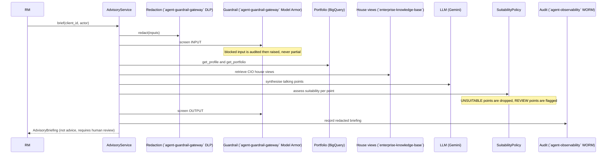

# `cio-advisory` CIO Advisory Assistant

**Industries:** Wealth & asset management, Private banking, Bancassurance, Brokerage & capital markets

Grounded, suitability-checked, **decision-support** talking points for private-bank
relationship managers (RMs), built ports-and-adapters on the Gemini Enterprise Agent
Platform and pinned to `asia-southeast1` (Singapore) for residency.

> **This is decision-support, NOT financial advice.** Every output is suitability-tagged,
> carries a non-advice disclaimer, and is maker-checker gated. The RM is the human checker
> and is responsible for any advice given to the client. The sample client/portfolio data
> shipped here is fictional.

`cio-advisory` connects the bank's **CIO house views** (retrieved from the governed `enterprise-knowledge-base` knowledge base)
to a specific **client's portfolio**, and produces personalised talking points, each with a
suitability verdict (SUITABLE / REVIEW / UNSUITABLE) and citations. Unsuitable points are
dropped, never presented as a recommendation.

## What it produces

| Artifact | Description |
|---|---|
| **AdvisoryBriefing** | The deliverable for one client: talking points, a portfolio alignment summary, and the mandatory non-advice disclaimer. Always requires human review. |
| **TalkingPoint[]** | A personalised point linking a CIO house-view theme to the client's holdings, with its suitability assessment and citations. Never advice. |
| **SuitabilityAssessment** | Per theme, a verdict against the client's risk profile, objectives, knowledge and concentration, with factors, rationale and citations. |

## Architecture at a glance

```mermaid
flowchart LR
  RM["Relationship manager"] --> API["FastAPI / CLI / ADK agent"]
  API --> SVC["AdvisoryService (domain core)"]
  SVC --> POL["SuitabilityPolicy (the regulatory heart)"]
  SVC -. ports .-> ADP{"Adapter profile"}
  ADP -->|gcp| GCP["Gemini · BigQuery · Model Armor · DLP · Cloud Logging"]
  ADP -->|local| LOC["Offline laptop stack (SQLite FTS5 · deterministic LLM · regex DLP)"]
  ADP -->|platform| SIB["`agent-guardrail-gateway` · `enterprise-knowledge-base` · `agent-registry` · `model-quality-gate` quality · `agent-observability`"]
  ADP -->|onprem| ONP["On-prem placeholders (migration target)"]
  SVC --> OUT["AdvisoryBriefing (not advice, cited, human-review)"]
```

## The pipeline (R1 full safety)

`cio-advisory` handles customer PII, so the full `agent-guardrail-gateway` redaction plus guardrail pipeline runs on every
request, exactly like `compliance-advisory` and `cdd-sow-research`.



## Run locally (no Google Cloud needed)

The `local` profile is a WORKING offline stack: SQLite FTS5 over the CIO house views, a
deterministic schema-driven LLM, a heuristic guardrail, regex DLP, and an append-only
local audit store. No API key, no Google Cloud SDK, no emulator.

```bash
python3.12 -m venv .venv && . .venv/bin/activate
pip install -e ".[dev]"

# Tests + lint + eval run on the local profile (no GCP SDK).
make test
make lint
make eval        # the `model-quality-gate`-style offline promotion gate

# Build a real, cited, suitability-tagged briefing offline. The house-view corpus and a
# couple of synthetic clients are seeded automatically; client-000042 is a balanced client.
CIO_PROFILE=local cio-advisory briefing client-000042
```

`briefing` prints the not-advice banner, one suitability-checked talking point per house
view (SUITABLE / REVIEW, UNSUITABLE dropped), the house-view citations, and the portfolio
alignment. Try `talking-points client-000077` (a conservative client) to see UNSUITABLE
themes dropped. The default DB lives under `~/.cio_advisory/`; set `CIO_LOCAL_DB=:memory:`
for an ephemeral run.

By contrast, `CIO_PROFILE=onprem cio-advisory briefing client-000042` exits `2` with the
on-prem migration message: those adapters are fail-fast placeholders.

### Optional: higher-fidelity local with Google emulators

For the in-process stores (sessions, memory, registry) the local adapters route to
Google's official Firestore emulator when `FIRESTORE_EMULATOR_HOST` is set AND the `[gcp]`
extra is installed; the google client is imported lazily, only on that branch, so the
default path stays SDK-free. There is no emulator for File Search, Gemini, Model Armor or
DLP, so those always use the SDK-free workaround.

## Profiles

| Profile | Adapters | Use |
|---|---|---|
| `gcp` | Managed Gemini Enterprise Agent Platform | Standalone production |
| `local` | Offline SQLite FTS5 + deterministic LLM (SDK-free) | Dev, tests, CI, demos |
| `platform` | HTTP clients to `agent-guardrail-gateway` / `enterprise-knowledge-base` / `agent-registry` / `model-quality-gate` / `agent-observability` | Inside the full platform |
| `onprem` | Placeholders (migration target) | On-prem port, fail-fast |

Switch with `CIO_PROFILE`, and always set it: an unset variable binds the offline adapters
but withholds every `local` relaxation (no seeded personas, no localhost CORS fallback).
Nothing in `src/cio_advisory/domain` changes between profiles:
that is the no-lock-in proof (P-02), exercised by `tests/contract/test_port_parity.py`,
which now verifies both the `local` (working) and `onprem` (fail-fast) adapters.

## Layout

```
src/cio_advisory/
  domain/        pure core: models, AdvisoryService, SuitabilityPolicy, prompts, ...
  ports/         runtime-checkable Protocols (the hexagon boundary)
  adapters/      gcp/ (managed, lazy SDK) · local/ (offline SQLite + deterministic LLM) · platform/ (HTTP siblings) · onprem/ (stubs)
  api/           FastAPI app, deps, schemas
  cli/           Typer CLI (cio-advisory)
  agent/         ADK root agent, tools, callbacks, grounding sub-agent
config/          settings.yaml (port -> adapter bindings; the build contract)
eval/            offline promotion gate + golden set + rubrics
infra/terraform/ asia-southeast1 sovereign stack (BigQuery, DLP, Model Armor, KMS, WORM, ...)
ui/              React / Next.js front end (source only)
```

## Documents

- [SPEC.md](SPEC.md) : the system specification.
- [ARCHITECTURE.md](ARCHITECTURE.md) : the hexagon, profiles, and data flow.
- [COMPLIANCE.md](COMPLIANCE.md) : how P-01..P-12 and R1..R6 map to concrete controls here.
- [CONTRIBUTING.md](CONTRIBUTING.md) : the hard gate and how to extend the hexagon.
- [docs/runbook.md](docs/runbook.md) : operating the service.
- [docs/onprem-migration.md](docs/onprem-migration.md) : porting to an on-premise platform.

## Cost and latency

Size this system's cost and latency with the shared interactive calculator: [**live**](https://portable-genai.github.io/cost-latency-calculator/calc/calculator.html?system=cio-advisory) or the [in-repo page](cost-latency-calculator.html). The engine and the pricing book are maintained once in [cost-latency-calculator](https://github.com/portable-genai/cost-latency-calculator).

## License

Apache-2.0. See [LICENSE](LICENSE).

## Documentation authority

Precedence is `SPEC.md` > `ARCHITECTURE.md` > `COMPLIANCE.md` > `README.md`. The first
document owns behavior; later documents explain design, evidence, and use without
overriding it.
